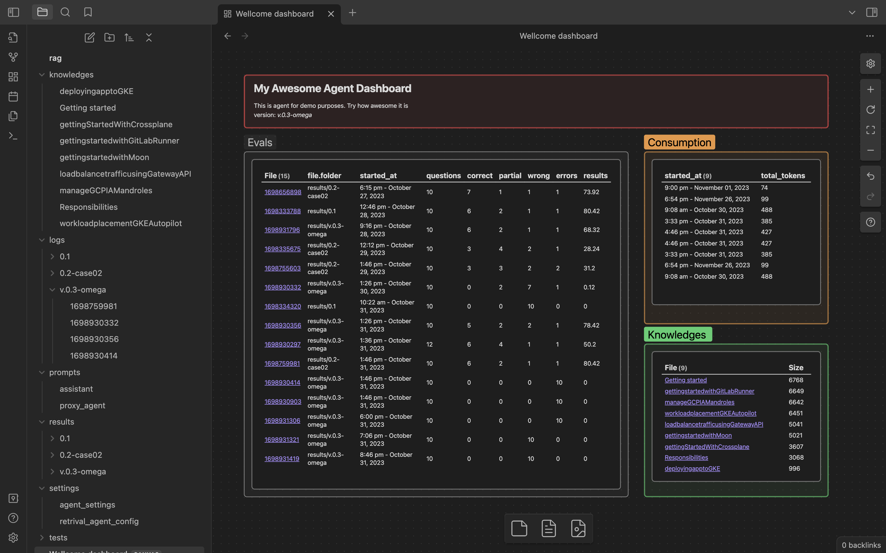

# Obsidian AutoGen Framework

Elevate your AI agents with the robust Obsidian AutoGen framework.

The Obsidian AutoGen framework is designed to assist developers in the testing, monitoring, and benchmarking of AI agents developed using AutoGen with minimal coding required.

Initiated during the AutoGen 24-hour Hackathon, this project is currently in a Work-In-Progress phase. The repository provides conceptual frameworks rather than out-of-the-box solutions, with an alpha release scheduled for late November 2023.

Our inspiration stems from insightful articles which can be explored here: [DLite RAG Applications](https://dlite.cc/2023/10/04/2023-eval-rag-apps.html) and [LLM Patterns by Eugene Yan](https://eugeneyan.com/writing/llm-patterns/#how-to-apply-evals).

---

Upon initial setup, we offer three examples: RAG, Task Solving, and Code Generation. Clone this repository, configure it with your API keys and custom AutoGen settings, and execute the provided Python script. The outcome is an evaluation score for your model, benchmarked against human-validated examples. Refine your agent by reviewing logs and consumption metrics.

## Development Roadmap
- Release of RAG alpha version
- Task-solving example implementation
- Code generation with integrated validation
- CI/CD pipeline templates for seamless model deployment
- AutoGen agent constructor

## Feature Overview
### Knowledge Management
Centralize and manage all your RAG data within a single Obsidian Vault for optimal organization and control.

### Benchmarking Platform
Our Eval Driven Development platform enables you to quickly test your model and obtain quality benchmarks for the current configuration. Compare performance across different LLMs, such as ChatGPT and LLaMa, to discern how agent quality varies with each model. Our platform supports benchmarking for both text and code-generated models with dynamic inputs.

### AutoGen No-Code Solution
Leverage our pre-configured Obsidian vaults and Python scripts to rapidly deploy your AutoGen agents, using Obsidian as a centralized command center.

### Monitoring Tools
Efficiently track agent outputs and resource consumption. Post-execution, all data is saved and compiled for comprehensive analysis. Manage your token usage and model output with a unified monitoring tool.

### Interactive Debugging Interface
Utilize Gradio to interactively test and refine your agent's performance.

### CI/CD Integration
After fine-tuning your model, employ our predefined CI/CD workflows to ensure a smooth transition of your model into production environments.

### Obisidian AutoGen DSL
Build your own custom agent based on AutoGen with our DSL